# 阿里二面问“每天1000万订单如何设计”，答 分库分表 挂了。王炸答案 是 “架构七件套+异构存储“

FSAC未来超级架构师 架构师总动员 
实现架构转型，再无中年危机

## 写在开头
在45岁老架构师尼恩的 **读者交流群**（50+人）里，最近不少小伙伴拿到了阿里、滴滴、极兔、有赞、希音、百度、字节、网易、美团这些一线大厂的面试入场券，恭喜各位！ 前两天就有个小伙伴面阿里，  在阿里二面中，针对  “让每天1000万订单查询，如何优化” **的场景题 ，仅回答使用**“分库分表”，导致面试失败。 **核心教训**：技术架构不能只回答一个点，必须严格适配具体场景的核心诉求。 小伙伴  没有看过系统化的 答案， **回答也不全面**，so，   面试官不满意  ， 面试挂了。 小伙伴找尼恩复盘， 求助尼恩。 这里尼恩给大家做一下   系统化、体系化的梳理一个 王炸答案 ，使得大家可以充分展示一下大家雄厚的 “技术肌肉”， **让面试官爱到 “不能自已、口水直流”**。 同时，也一并把这个题目以及参考答案，收入咱们的 《 [尼恩Java面试宝典PDF](https://mp.weixin.qq.com/s?__biz=MzkxNzIyMTM1NQ==&mid=2247497474&idx=1&sn=54a7b194a72162e9f13695443eabe186&scene=21#wechat_redirect)》V176版本，供后面的小伙伴参考，提升大家的 3高 架构、设计、开发水平。 > 最新《尼恩 架构笔记》《尼恩高并发三部曲》《尼恩Java面试宝典》的PDF，请关注本公众号【技术自由圈】获取，后台回复：领电子书

# 每天1000万订单查询优化——阿里面试实战全解析（架构七件套 +  异构存储）
45岁的老架构师尼恩， 把压箱底的系统化 ，体系化 方案，现在 拿出来 给大家 ， 作为  大厂 的入场券 。 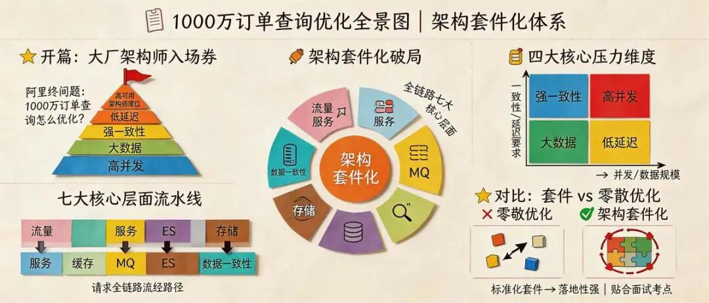
这个威力很大， 刚才一个二本小伙伴来报喜， 拿着尼恩的方案， 收到 了微信的邀请，  破天荒，逆天改命了。 > 刚来报喜的：二本 学历， 小公司 出身，  拿到 殿堂级（腾讯） 面试邀请 ，  祖上积德，震惊了  逆天改命开启

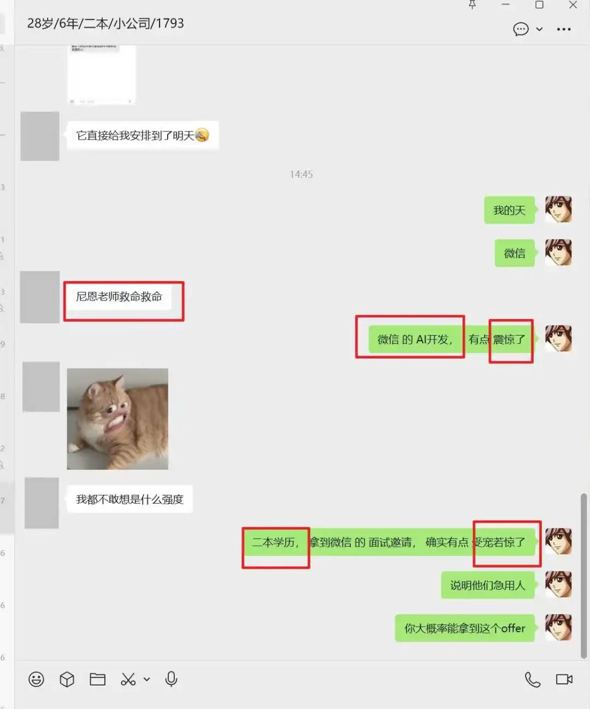
# 一、开篇：这道阿里面试题，考的不是技术，是架构思维
解密一下：阿里终面常抛出这样一个看似朴素、实则锋利 的问题——“每天1000万订单查询，怎么优化？” 它绝非单纯考察SQL调优技巧，而是对候选人在高并发、大数据、强一致性、低延迟四重压力下，系统性架构思维的一次极限拷问。 这道题的底层逻辑，直指现代电商系统的性能命门：不是能不能查出来，而是能否稳、快、准、久地查出来。 换言之——这不是一道题，而是一张通往大厂高可用架构师席位的入场券。 尼恩高维度暴击逻辑： - 以“架构套件化”思维破解瓶颈
- 串联流量、服务、缓存、MQ、ES、存储、数据一致性七大核心层面
- 用标准化套件体系替代零散优化，既保证落地性，又贴合面试高频考点。

# 二、整体思路：以架构套件为核心，构建全链路协同防御体系

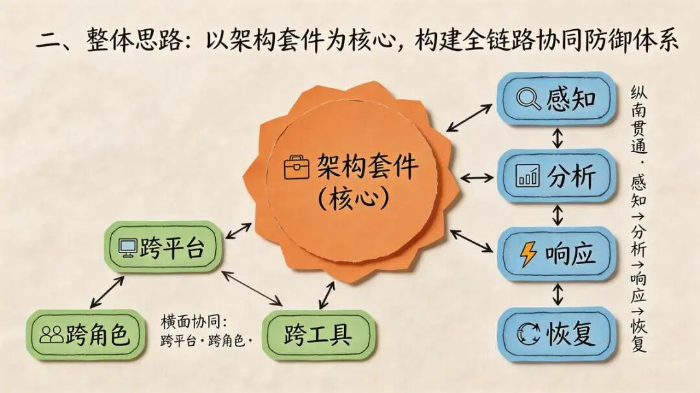
## 2.1 问题：当MySQL主库成为系统瓶颈，业务正在无声窒息
每天1000万订单查询 ，系统会有 哪些  典型告警？ 说出来，大家可能会惊心动魄，比如： ✅ 订单提交后， 用户刷新页面，  但是，却又 “查不到刚下的单”，客服电话骤增； ✅ 大促期间，  监控大盘突现 尖刺，  突然预警： MySQL连接数100%、平均查询延迟从50ms飙升至2.3s； ✅深夜收到 DBA 主从延迟告警：Seconds_Behind_Master > 600s，用户“已付款”却显示“待支付”。 其实，这就是，DB架构不合理， 在高并发场景下的必然坍塌。 底层问题： - 这 不是DB性能优化题，而是业务连续性的生死线
- 表象是数据库过载，根因，  是架构套件体系缺失
- 需通过完整架构套件体系破解，而非单点修修补补。

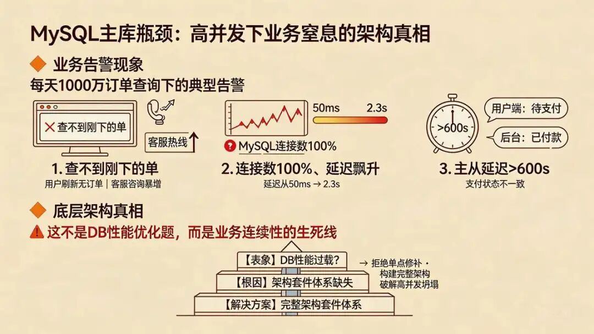
## 2.2 原因：表象是数据库过载，根因是架构套件体系缺失
如果要彻底解决问题， 绝非简单“加索引”或“升配置”可解。 其本质是架构没有设计好， 缺乏分层治理与全链路防护能力。 尼恩给大家分析一下， 架构层面的缺失及后果具体如下： **一：流量层问题**核心问题是 未落地 **流量架构三件套**，缺乏明确的请求分级与路由策略。 流量架构三件套 没有落地，  导致的后果放大机制十分明显。 小流量携带的大查询会直接拖垮主库连接池，进而引发系统雪崩，影响整体服务可用性。 **二：服务层问题**在服务层，未落地 **服务架构三件套**，导致服务间耦合度高、同步链路过长。 这种架构缺陷 ，  使得高频读请求无法得到有效拦截和分流，全部穿透至数据库。 这样， 让主库被迫承担本不该有的缓存功能，沦为“缓存服务器”，大幅增加主库负载。 **三： 搜索层问题**在 搜索层，没有 落地 **搜索层四件套**，过度依赖MySQL原生查询。 这就导致系统被迫执行慢SQL，为了满足离线分析需求，不得不牺牲在线服务的稳定性，形成“顾此失彼”的被动局面。 **四：存储层问题**在存储层，未落地 **存储层四件套**。 数据未进行分层处理，也未实现多存储协同架构（即未搭建MySQL+CDC+HBase+ClickHouse架构）。 - 单表臃肿，冷热混存， 查询‘失速’：

冷热混存 有一个巨大的恶果：  使得核心表突破千万级阈值 冷热混存  还有一个 大恶果：  索引区分度下降，大量查询被迫退化为 **全表扫描**， **索引失效**， 响应时间从毫秒级恶化至秒级； - 低效查询反噬数据同步链路

大量的全表扫描与高频回表  重量级操作 ， 耗尽了数据库的 I/O 配额与 CPU 资源，严重挤占了 **CDC（Change Data Capture）**进程的读取带宽。这直接导致日志解析延迟增加，多端数据同步出现显著积压，破坏了数据的实时性与一致性。 - 冷热混存，Buffer Pool失效

缺乏分层存储机制，使得昂贵的内存缓冲池（Buffer Pool）被低频访问的历史冷数据占据，大幅降低了热点数据的缓存命中率。 加之缺乏 **ClickHouse**等列式引擎分担复杂分析查询，所有压力集中于交易库，导致系统整体吞吐量持续衰退，无法支撑业务的线性扩展。 **根本结论：**早期 没有建立基于架构套件的分层治理体系， 只是 用关系型数据库硬扛所有场景， 用 **局部调优+碎片优化**替代系统化 设计，如同用碎片积木搭建高楼； 如同用单一工具应对所有场景，无法适配冷热数据分离与分析型查询需求。 ## 2.3 方案：架构七件套 +  异构存储 ，构建“三可”的全链路防护体系
尼恩带着大家，摒弃“头痛医头”式优化。 做系统化、体系化、全面化的升级。 尼恩在这里，带着大家  落地七大架构套件协同方案。七大架构套件协同， 构建“三可”的全链路防护体系： - 可验证
- 可灰度
- 可度量

七大架构套件  非常 牛逼， 覆盖从流量入口到数据存储的全链路。 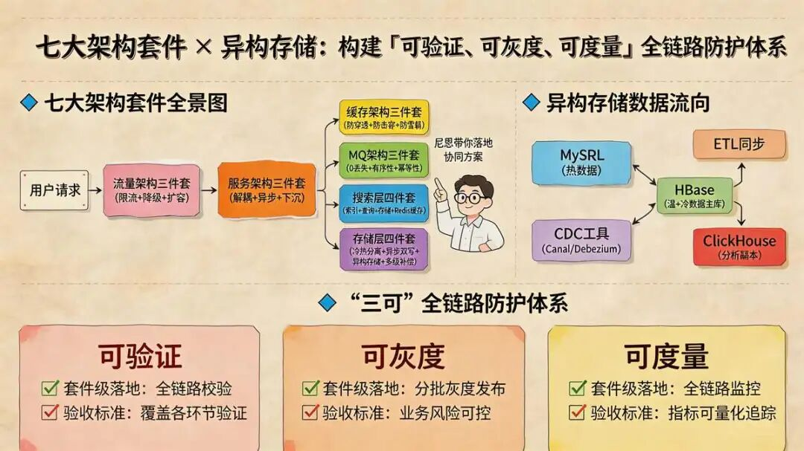
七大架构套件 ,   每一套件均对应明确落地动作与验收标准。 尼恩团队这一个视频，  来介绍架构七件套+  异构存储 （ MySQL+CDC+HBase+ClickHouse） 架构升级。 七大架构套件  全景图： 从用户请求到各层架构套件再到具体技术组件的完整链路： 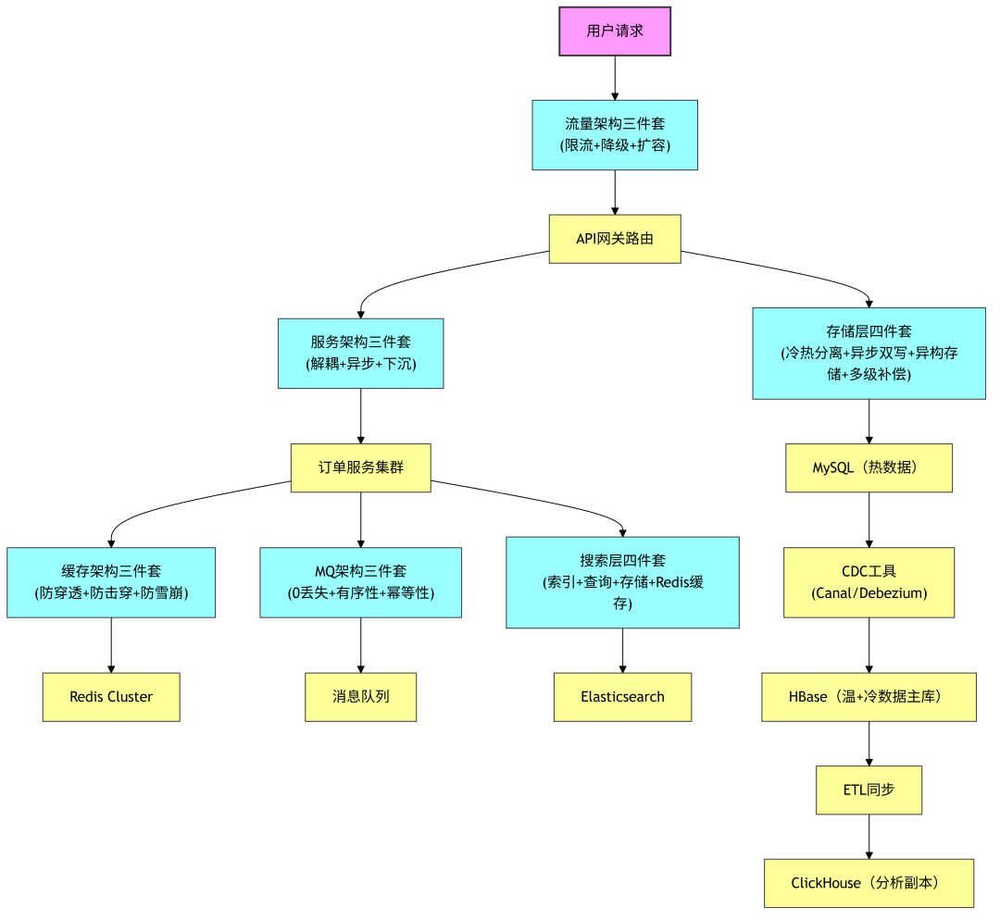
#### 架构七件套+  异构存储 （ MySQL+CDC+HBase+ClickHouse） 的优势
- ✅ 技术债清零：套件化设计消除“不敢动索引”“不敢加字段”的历史包袱，MySQL+HBase+ClickHouse架构适配不同数据场景，架构可复用、可演进；
- ✅ 团队能力升级：开发聚焦业务逻辑，DBA转向数据治理与SLO保障，运维聚焦套件监控与多存储集群运维；
- ✅ 演进路径打开：七大套件天然支持未来接入更多存储引擎，适配业务增长，ClickHouse可无缝承接更大规模的分析查询需求。

# 三、架构七件套+  异构存储   逐一拆解

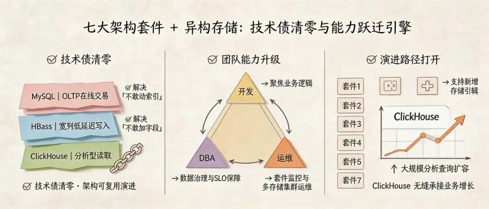
## 3.1 流量架构三件套：限流 + 降级 + 扩容，守住系统第一道防线
流量层的系统稳定性，是整条技术链路不可撼动的基石。 '流量架构三件套（限流、降级、扩容）彼此独立、同等关键、缺一不可。 共同实现“拦截无效流量、保障核心链路、弹性承接峰值”的目标。 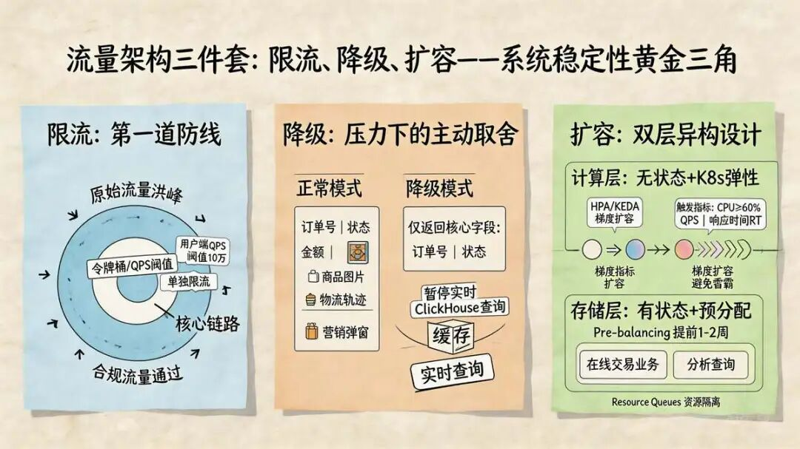
### 1. 限流：精准拦截超额请求，筑牢第一道防线
限流是系统最前端的守门人，核心是“只让合理流量进入核心链路”。 基于Sentinel等高效组件，按用户、IP、接口维度设定QPS阈值，对海量请求实施维度化拦截。 一旦突发流量试图击穿下游，限流就是那道不可逾越的红线。 限流，它不让一个超额请求滑入核心链路，避免无效流量消耗宝贵资源。 限流 落地细节： - 订单查询接口按场景分级限流（用户端QPS阈值10万，运营后台QPS阈值100 ），结合令牌桶算法，避免突发流量导致的链路拥堵；
- 针对ClickHouse分析查询，单独设置限流阈值，避免分析查询占用过多存储资源。

### 2. 降级：主动舍弃非关键路径，保障主干持续可用
降级是系统在压力下的清醒抉择，核心是“牺牲非核心体验，保住核心功能”。 面向优惠券详情、用户足迹、营销弹窗等L3级非核心功能，预埋降级开关。 当系统压力超阈值（如DB CPU>85%、HBase查询延迟>500ms），立即触发降级，返回预设默认值或空数据，将全部算力留给订单查询、支付确认等L1级核心环节。 降级 落地细节： - 订单查询接口降级时，仅返回核心字段（订单号、状态、金额）
- 订单查询接口降级时，  暂停返回商品图片、物流轨迹等非核心信息，降低请求耗时与资源占用；
- 运营分析类查询降级时，优先返回缓存结果，暂停实时查询ClickHouse，避免拖垮分析链路。

### 3. 扩容：弹性释放计算资源，从容承接流量洪峰
扩容是系统应对峰值的底气所在，核心是“动态匹配流量与资源”。 依托无状态服务架构，配合K8s自动伸缩能力，实现水平方向的快速伸缩： - 当流量涌来时，分钟级完成实例增扩；
- 高峰退去后，资源自动回收，实现“按需分配、成本最优”。

落地细节： **（1）计算层（无状态）：分钟级弹性伸缩**依托 K8s 无状态架构，构建多维度的自动伸缩体系： - 多维指标触发：不仅监控 CPU（阈值 60%）， 结合QPS、平均响应时间（RT）、线程池活跃度等自定义指标（Custom Metrics），避免 IO 密集型场景下的扩容滞后。
- 梯度扩容策略：配置 HPA（水平自动伸缩）与 KEDA（事件驱动伸缩）。平时保持最小可用实例；流量上涨时，分批梯度扩容（避免雪崩式启动导致依赖崩溃）；高峰退去后，设置冷却期（Cooldown）防止震荡回收。

**（2）存储层（有状态）：提前预热与资源隔离**鉴于 HBase、ClickHouse、ES 等有状态组件涉及数据重平衡（Rebalance），无法实现分钟级生效。 采取 **“预分配 + 隔离”**策略： - 大促前静态扩容：基于历史流量模型，提前 1-2 周完成存储节点的扩容与数据预均衡（Pre-balancing），确保新节点在洪峰前已承载正常流量比例。
- 资源隔离保护：针对分析查询峰值，不临时扩容主集群，而是利用ClickHouse 的资源队列（Resource Queues）或独立只读副本集群进行隔离，防止分析大查询拖垮在线交易业务。
- 缓存层弹性：Redis 集群采用Proxy 模式或分片预预留，确保内存水位在安全线（如 70%）以下，避免触发逐出策略影响热点数据。

面试加分点： - 空间并列，协同发力：限流（拦截恶意/超量流量）、降级（牺牲非核心保核心）、扩容（承接有效增长）三者并行。
- 全链路压测验证：所有扩容策略必须经过全链路压测验证，确保在真实数据量级下，存储层的数据均衡时间和计算层的启动速度满足 SLA 要求。

## 3.2 服务架构三件套：解耦 + 异步 + 下沉，缩短查询路径、释放服务潜力
服务架构三件套是订单查询性能提升的核心引擎。 通过“解耦 、异步 、下沉 ”，让订单查询从“主链路上的负担”，转变为“可独立扩展、可高效响应”的能力单元 。 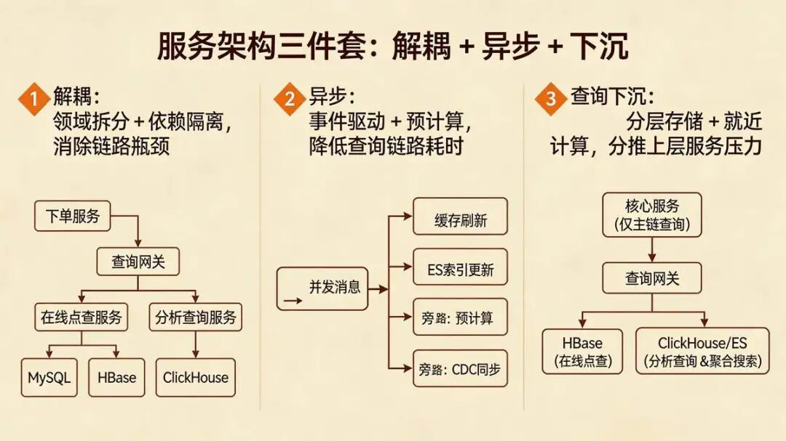
### 1. 解耦：领域拆分 + 依赖隔离，消除链路瓶颈
核心动作：将订单服务按领域边界，拆分为“下单服务”与“查询服务”两个独立服务，实现物理隔离、数据自治、接口契约化。 彻底消除“写操作影响读性能”的瓶颈：  写操作（下单、支付）全部由下单服务承接，读操作（订单查询）全部由查询服务承接。 同时将查询服务拆分为“在线点查服务”与“分析查询服务”，分别对接HBase与ClickHouse，实现查询链路解耦。 落地细节： - 通过微服务架构实现服务解耦
- 采用OpenFeign/gRPC/Dubbo3 实现服务间调用
- 引入服务注册发现（Nacos），确保两个服务独立部署、独立扩容，互不影响；
- 在线点查服务直连MySQL与HBase，分析查询服务直连ClickHouse，通过查询网关实现路由分发。

### 2. 异步：事件驱动 + 预计算，降低查询链路耗时
核心动作： 事件驱动 架构， **旁路操作   脱离 主事务流程（主路流程），**不抢占线程、不延长RT、不拖慢响应。 ### 3. 查询下沉：分层存储 + 就近计算，分摊上层服务压力
核心动作： - 将所有高危聚合查询（如最近三个月订单统计、跨域履约热力图）、聚合搜索查询，全部从核心服务下沉至专用查询服务
- 高危聚合查询   ClickHouse（分析查询）或ES，彻底卸载核心服务与MySQL主库  聚合查询  压力。
- 在线点查 直连HBase ，彻底卸载核心服务与MySQL主库  在线点查 压力。
- 同时结合分层存储，将不同热度数据下沉至对应存储引擎，实现“就近计算、精准匹配”。

> 尼恩提示：原文3w字以上，  此文是精简版，完整版本，请参考 尼恩 免费百度网盘 免费pdf

## 3.3 缓存架构三件套：防穿透 + 防击穿 + 防雪崩，守住缓存生命线
" **缓存架构三件套**"（防穿透、防击穿、防雪崩），旨在针对性解决三大致命陷阱。 这套机制不仅防止缓存失能后 MySQL 与 HBase 被流量洪峰冲垮，更深度适配了 **MySQL**（热数据）的多存储协同架构，确保全链路稳定性。 **多存储架构下的三大致命陷阱****1. 缓存穿透：无效请求  “穿堂风”**大量恶意或异常请求查询根本不存在的 `order_id`。 由于缓存中无命中，请求直接穿透至底层存储。 **危害**：导致 MySQL/HBase  执行大量无效 查询，  处理无数空行检索，瞬间拉高 CPU 与 IO 水位，挤占真实业务的资源，严重时导致数据库连接池耗尽。 **2. 缓存击穿：热点失效 “决堤口”**某些超高热度 Key（如爆款商品订单、大促整点秒杀单）在过期瞬间，面临海量并发请求  同时回源  至底层存储。 **危害**：原本由缓存抗住的百万级 QPS 瞬间压向数据库。  同时回源   ， 对于 MySQL 可能导致锁竞争加剧、RT 陡增；对于 ClickHouse，频繁的高并发点查可能触发合并树（MergeTree）的压力阈值，引发查询排队甚至节点宕机。 **3. 缓存雪崩：集体失效的“多米诺”**由于设计失误，大量 Key 设置了相同的过期时间，导致在同一时刻集体失效。 **危害**：形成脉冲式流量洪峰，瞬间击穿所有防御。这不仅会让 MySQL 和 HBase 瘫痪，还会因级联故障波及下游的 ClickHouse 分析集群，导致整个订单链路不可用，甚至引发全站雪崩。 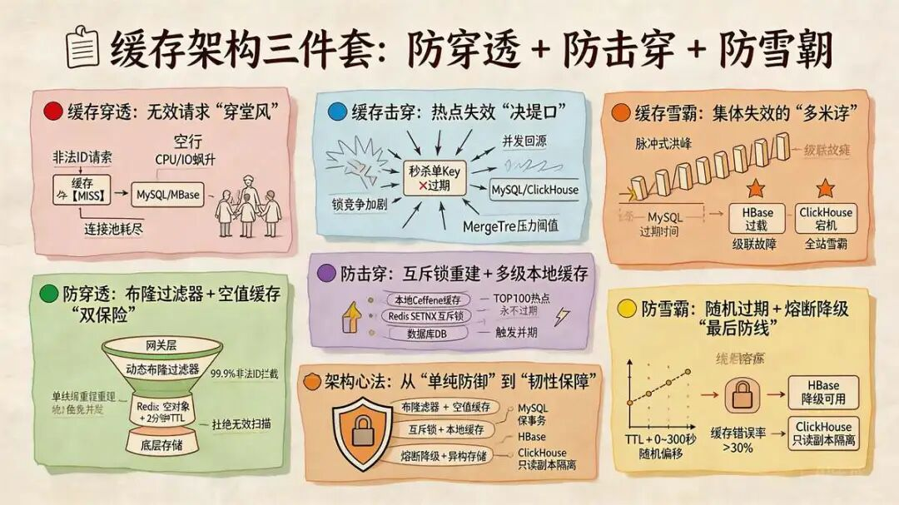
**尼恩珍藏的  落地方案：构建“韧性护城河”的协同防御体系**> 尼恩提示：原文3w字以上，  此文是精简版，完整版本，请参考 尼恩 免费百度网盘 免费pdf

## 3.4 MQ架构三件套：0丢失 + 有序性 + 幂等性，保障数据同步可靠
MQ是订单系统异步化的核心载体，负责缓存刷新、ES同步、数据归档、CDC同步触发等关键异步任务. MQ 承担着MySQL与HBase、ClickHouse之间的数据同步衔接作用。 MQ架构三件套（0丢失、有序性、幂等性），解决异步链路的数据可靠性问题，杜绝因消息异常导致的订单查询数据错乱、同步断层，保障多存储架构的数据一致性。 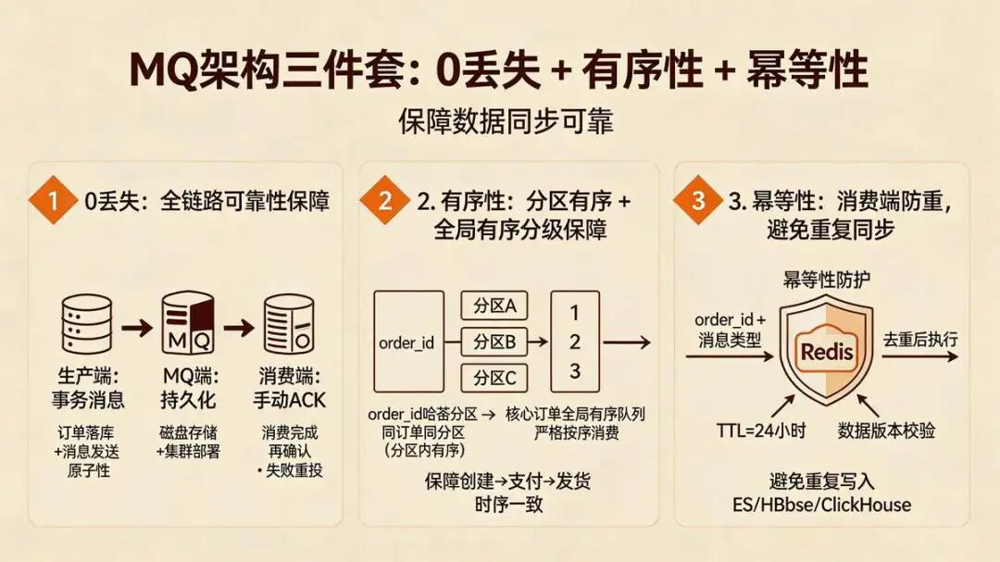
### 1. 0丢失架构：全链路可靠性保障，杜绝数据同步断层
核心目标： 确保订单相关消息（创建、支付、取消）不丢失，实现“生产端→MQ→消费端”全链路可靠，重点保障MySQL到HBase、HBase到ClickHouse的同步消息不丢失。 落地时兼顾性能与可靠性，避免过度追求强一致导致的吞吐下降。 落地细节： - 生产端开启事务消息，确保“订单落库”与“消息发送”原子性；
- MQ端开启持久化（磁盘存储），集群部署避免单点故障；
- 消费端开启手动ACK，确保消息消费完成后再确认，未消费完成则重新投递；

针对CDC同步消息，单独设置消息优先级，确保MySQL数据实时同步至HBase，HBase数据通过ETL同步至ClickHouse时，消息不丢失、不延迟。 ### 2. 有序性架构：分区有序 + 全局有序分级保障，匹配订单业务诉求
核心目标： 确保同一订单的相关消息（如创建→支付→发货）按顺序消费，避免因消息乱序导致的缓存与DB数据不一致（如先消费“支付”消息，再消费“创建”消息），尤其保障MySQL到HBase的同步消息有序，避免HBase中订单数据错乱。 落地细节： - 按order_id哈希分区，同一订单的所有消息路由至同一MQ分区，实现分区内有序；
- 对核心订单（如高客单价订单），采用全局有序队列，确保消息严格按发送顺序消费，满足业务强有序诉求；
- CDC同步消息按order_id分区，确保同一订单的数据同步顺序与业务操作顺序一致，避免HBase、ClickHouse中数据时序错乱。

### 3. 幂等性架构：消费端防重，避免重复同步导致数据错乱
核心目标： 避免因消息重复投递（如网络异常、MQ重试），导致消费端重复处理，出现缓存重复刷新、ES索引重复创建、HBase/ClickHouse数据重复写入等问题，尤其避免多存储同步时的重复数据。 落地细节： - 消费端基于order_id + 消息类型（如“create”“pay”“sync_hbase”“sync_clickhouse”）构建唯一幂等键，存入Redis；
- 消费前先校验幂等键，存在则直接返回成功，不存在则执行消费逻辑，消费完成后写入幂等键，TTL设置为24小时，兼顾性能与防重效果；
- 针对HBase、ClickHouse的同步消息，额外增加数据版本校验，避免重复写入导致的数据冗余。

关键提示： MQ三件套是异步架构的“基石”——0丢失保障数据可靠，有序性保障业务正确，幂等性保障系统稳定，三者缺一不可； 尤其在MySQL+HBase+ClickHouse的多存储架构中，MQ是数据同步的核心枢纽，其可靠性直接决定多存储之间的数据一致性，否则异步链路会成为系统隐患，反而加剧订单查询的数据不一致问题。 ## 3.5 搜索层四件套：索引优化 + 查询优化 + 存储优化 + Redis缓存优化，提升聚合搜索效率
ES+ClickHouse 负责承接订单系统的聚合搜索场景（运营报表、多维度筛选、模糊查询），替代MySQL承担高频复杂查询压力。 **尼恩珍藏的 架构心法， ES与ClickHouse形成互补：**- ES  侧重实时检索
- ClickHouse侧重批量分析。

搜索层四件套，从索引、查询、存储、缓存四个维度优化，确保检索响应快速、稳定、高效，同时与MySQL+HBase+ClickHouse架构协同。 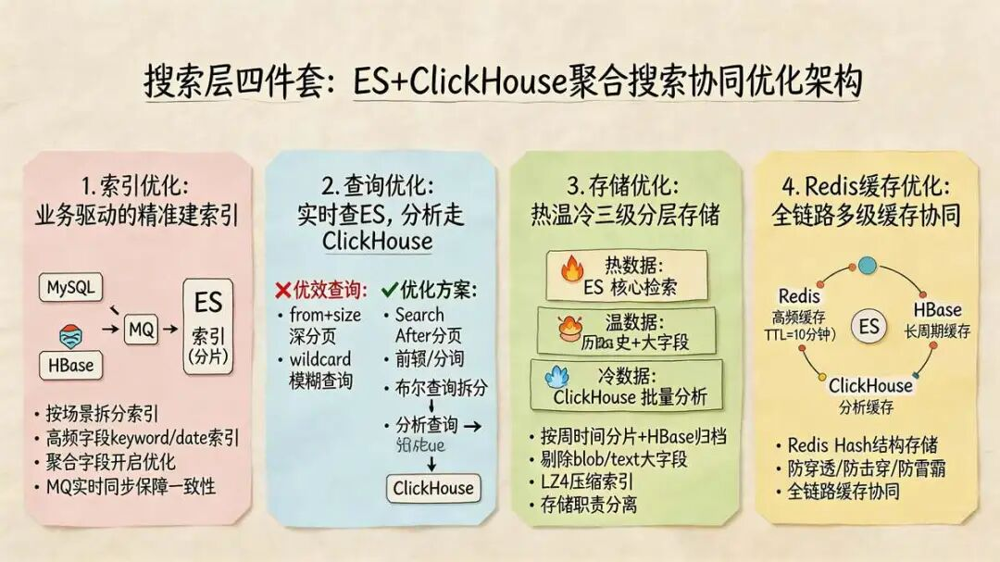
> 尼恩提示：原文3w字以上，  此文是精简版，完整版本，请参考 尼恩 免费百度网盘 免费pdf

## 3.6 存储层四件套：冷热分离 + 异步双写 + 异构存储 + 多级补偿，释放DB潜力、保障数据可靠
存储层是订单数据的最终载体，使用  四件套的存储架构 存储层四件套以“MySQL（热数据）→ CDC工具（Canal/Debezium）→ HBase（温+冷数据主库）→ ETL同步→ ClickHouse（分析副本）”为核心， 通过“分层存储、多存储协同、数据可靠保障”，解决MySQL单机瓶颈，实现“性能、可靠性、成本”三者平衡，为订单查询提供稳定的数据支撑。 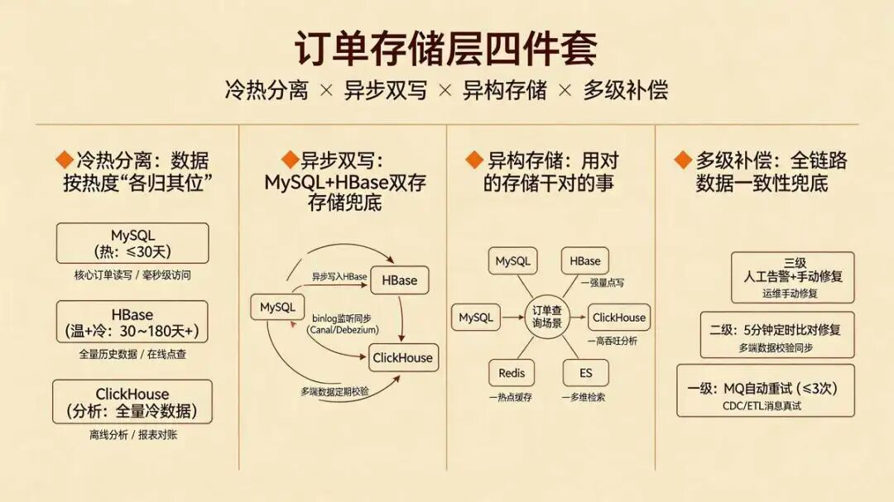
### 1. 冷热分离：按数据热度分层存储，让数据“各归其位”
**核心动作：**按订单访问热度与业务时效性，将数据拆分至MySQL、HBase、ClickHouse三大存储引擎 避免热数据与冷数据混存，拖慢查询性能，实现“热数据低延迟访问、冷数据低成本存储、分析数据高吞吐查询”。 **落地细节：****(1) 热数据（近30天订单）：存于MySQL主从集群，保障强一致性与毫秒级访问，承接核心订单读写、主键精准查询；****(2) 温数据（30~180天）：通过CDC工具（Canal/Debezium）从MySQL同步至HBase，由HBase承接在线点查请求，存储全量历史数据，兼顾访问性能与存储成本；****(3) 冷数据（>180天）：在HBase中压缩存储，同时通过ETL工具同步至ClickHouse，用于离线分析、财务对账等场景，不占用在线存储资源；****(4) 分析类数据：实时同步至ClickHouse，承接统计分析、报表查询等高频分析场景，释放MySQL、HBase压力。**### 2. 异步双写：核心数据双存储，提升数据可靠性
**核心动作：**- 对订单核心数据（如订单状态、支付金额），采用“MySQL+HBase”异步双写，确保核心数据不丢失，提升系统容错能力；
- 同时实现MySQL与ClickHouse的同步，确保分析数据的准确性，依托CDC工具与ETL任务实现全链路数据同步。

**落地细节：**- 核心订单数据在MySQL落地后， 异步写入HBase，实现双存储兜底。
- 通过Canal/Debezium监听MySQL binlog，实现MySQL与ClickHouse数据实时同步，确保热数据向温/冷数据无缝迁移；
- 开启双写校验机制，定期对比MySQL与HBase、ClickHouse 多端核心数据，发现不一致时，通过多级补偿机制修复；
- HBase中的分析类数据，通过ETL工具同步至ClickHouse，同步过程中开启校验，确保分析数据与源数据一致；

### 3. 异构存储：多存储引擎协同，适配不同查询场景
**核心动作：**结合MySQL、HBase、ClickHouse、Redis、ES不同存储引擎的优势，为不同订单查询场景匹配专属存储，实现“用对的存储干对的事”，构建互补协同的存储体系。 **落地细节：****(1) MySQL：承载核心订单读写、主键精准查询（热数据），保障强一致性；****(2) HBase：承载温+冷数据存储、在线点查请求，存储全量历史数据，适配高频点查、大数量存储场景；****(3) ClickHouse：承载统计分析、报表查询、批量数据扫描场景，提供高吞吐分析能力，替代MySQL承担分析压力；****(4) Redis：承载高频热点查询、ES检索结果缓存、HBase/ClickHouse查询结果缓存，实现多级缓存加速；****(5) ES：承载复杂 在线 聚合查询、 多维度检索、模糊查询场景，提供实时检索能力；多引擎协同，最大化发挥各自优势，适配不同查询场景的需求。**## 3.7 数据一致性架构两件套：精准施策 + 场景分层，平衡一致性与性能
数据一致性是订单查询的核心诉求（如用户支付后立即查订单，需看到“已支付”状态）。 但强一致性与高并发、低延迟往往相互矛盾，尤其在MySQL+HBase+ClickHouse的多存储架构中，数据一致性保障难度更高。 数据一致性两件套（精准施策、场景分层），拒绝“一刀切”，根据业务场景匹配一致性策略，实现“一致性与性能”的最优平衡。 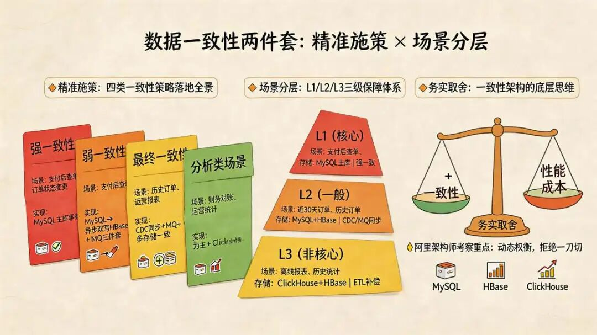
> 尼恩提示：原文3w字以上，  此文是精简版，完整版本，请参考 尼恩 免费百度网盘 免费pdf

# 四、场景驱动：用架构套件精准匹配业务，拒绝过度设计
1000万订单查询优化的核心，不是“堆砌架构套件”，而是“用套件匹配场景”——不同查询场景的瓶颈不同，对应的套件组合也不同，避免“一套套件用到底”的过度设计； 结合MySQL+CDC+HBase+ClickHouse的存储架构，针对性匹配场景，最大化发挥架构价值。 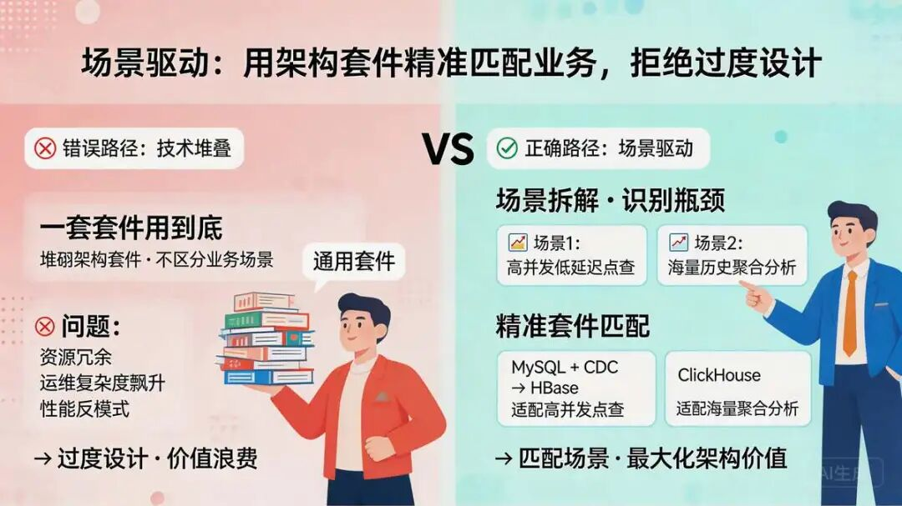
## 4.1 四大典型场景：套件组合方案（面试可直接套用）
在高并发订单系统的架构设计中，没有“万能钥匙”，只有针对特定业务场景的“组合拳”。以下四大典型场景展示了如何灵活调度 **缓存三件套、存储四件套、MQ三件套**等核心组件，实现性能与稳定性的最优解。 ### 场景一：高频热点访问（如 TOP100 商家实时查单）
**核心瓶颈**： 瞬时流量巨大，缓存命中率波动大，极易引发缓存击穿，导致 MySQL 或 HBase 连接池耗尽。 **推荐组合**： 缓存三件套 + 服务下沉 + 流量限流 + 存储协同（MySQL+HBase）。 **落地要点**： 针对此类场景，首要任务是构建 **多级缓存防御**。 将 TOP100 的热点订单数据预热至应用层本地缓存（Caffeine），并开启分布式互斥锁（SETNX）防止缓存击穿。 实施 **查询下沉策略**，将热点读请求直接路由至 **HBase**，利用其高吞吐特性分流 MySQL 压力。 配合 **流量限流**，在网关层拦截超出系统承载能力的异常流量，确保核心交易链路在洪峰中依然稳如磐石。 ### 场景二：聚合查询（/复杂条件检索）
聚合查询（/复杂条件检索） ,  主要是  运营多维度筛选 +聚合。 **核心瓶颈**： 关系型数据库（MySQL）在处理多字段组合查询、模糊匹配时效率极低，易产生大量慢查询拖垮主库。 **推荐组合**： ES 索引优化 + 服务异步 + MQ 三件套 + 存储协同（ES+ClickHouse）。 **落地要点**： 采用 **读写分离与异构存储**策略。 通过 **MQ 三件套**异步捕获 MySQL  的数据变更，实时同步至 **Elasticsearch (ES)**构建宽表索引，专攻复杂检索。 对于涉及大规模聚合统计（如“某区域月度销量排行”）的请求，进一步分流至 **ClickHouse**，避免 ES 因聚合计算过重而抖动。 整个数据同步链路由 **服务异步**机制驱动，确保检索数据的最终一致性，同时彻底解放 MySQL 的计算资源。 ### 场景三：大数据量扫描（财务月结对账）
**核心瓶颈**： 全表扫描或大范围区间查询会消耗巨额 IO 资源，导致在线业务响应延迟甚至超时。 **推荐组合**： **存储协同（HBase+ClickHouse） + 服务下沉 + 流量降级**。 **落地要点**： 严格执行 **冷热分离与计算卸载**。将历史冷数据归档至 **HBase**，并将对账所需的明细数据 ETL 至 **ClickHouse**。 所有月结、对账类的大批量扫描任务，强制路由至 ClickHouse 执行，利用其列式存储优势实现秒级响应。 此类任务必须通过 **服务下沉**为独立的后台作业，严禁在主线程同步执行。 一旦监测到系统负载过高，立即触发 **流量降级**机制，暂停非紧急的对账任务，优先保障用户下单、支付等核心链路的可用性。 ### 场景四：写多读少（IoT 设备订单流水）
**核心瓶颈**： 写入吞吐量要求极高，而读取频率极低，传统架构易出现写入阻塞或存储成本失控。 **推荐组合**： **存储四件套（MySQL+HBase+ClickHouse） + MQ 三件套 + 服务异步**。 **落地要点**： 构建 **“写快读慢”的流水线架构**。 写入请求首先由 **MySQL**承接核心状态（保证事务性），随即通过 **CDC + MQ**异步解耦，将全量流水数据快速追加写入 **HBase**（低成本海量存储），并并行 ETL 至 **ClickHouse**供后续离线分析。 对于极少数的查询请求，采用 **预计算**策略，将结果异步同步至缓存，避免直接穿透至底层存储。 整个链路依赖 **MQ 三件套**进行削峰填谷，确保高并发写入时系统不阻塞、不丢单，实现写入性能的最大化。 **总结**这四套方案并非孤立存在，而是基于 **“数据流向”**与 **“访问特征”**的动态编排： - 读多写少且热点集中→→ 重在缓存与分流（场景一）；
- 读模式复杂多变→→ 重在索引异构与异步同步（场景二）；
- 读范围极大→→ 重在专用引擎与降级保护（场景三）；
- 写多读少→→ 重在异步解耦与追加写入（场景四）。

## 4.2 方案收敛与验证：套件落地的闭环保障
架构套件落地不是“一次性部署” 架构套件落地   是“场景匹配→方案收敛→灰度验证→复盘演进”的闭环过程 针对MySQL+CDC+HBase+ClickHouse的多存储架构，需重点验证数据同步可靠性与多引擎协同性能，确保套件落地即见效，避免上线后返工。 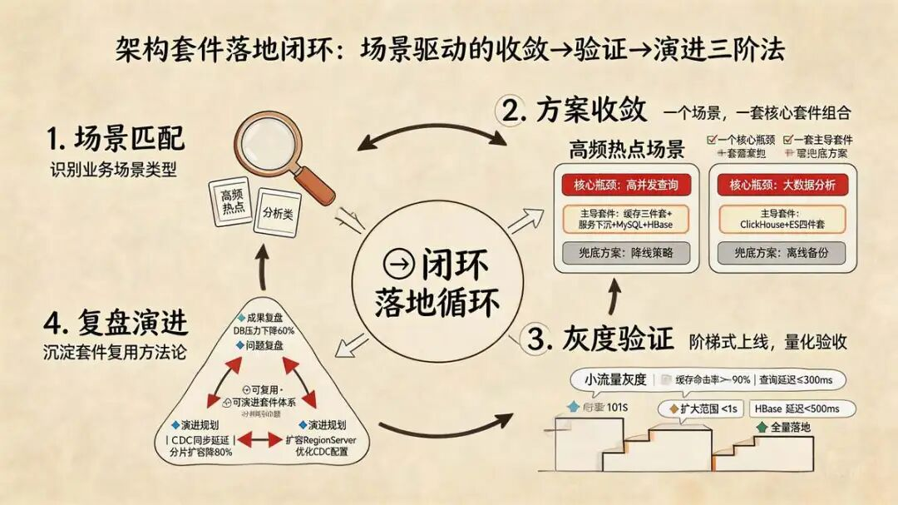
> 尼恩提示：原文3w字以上，  此文是精简版，完整版本，请参考 尼恩 免费百度网盘 免费pdf

# 五、面试实战：高频追问与标准答案（直击阿里终面，结合套件体系）
阿里终面更看重“套件体系背后的思考”和“问题应对能力”，尤其关注多存储架构的设计与落地细节。 以下是高频追问，附结合架构套件及MySQL+CDC+HBase+ClickHouse存储架构的标准答案，可直接背诵，适配面试场景。 ## 5.1 追问1：1000万订单，用分库分表（存储四件套）和用ES（ES四件套）、ClickHouse（存储四件套），区别是什么？什么时候选哪个？
标准答案（结合套件体系，逻辑清晰）： **核心区别：**分库分表属于存储层四件套，解决的是“MySQL单机数据存储容量”和“MySQL单机性能”瓶颈； ES属于搜索层四件套，解决的是“聚合搜索效率”瓶颈； ClickHouse属于存储层四件套，解决的是“批量分析查询高吞吐”瓶颈**， 三者定位不同，不是替代关系，而是互补关系，共同构成MySQL+ES+HBase+ClickHouse的异构存储体系。 选择逻辑（分场景）： **(1) 选分库分表（存储四件套）：**核心是“MySQL读/写都高频”，且查询以“主键/索引精准查询”为主（如用户查自己的订单详情），数据量持续增长，MySQL单机无法承载。 此时用分库分表+冷热分离（同步至HBase），保障MySQL读写性能，属于存储层套件的核心落地场景，适配热数据高频访问需求。 **(2) 选ES（ES四件套）：**核心是“聚合查询（/复杂条件检索）”，查询以“多维度组合、模糊匹配、聚合统计”为主（如运营查某地区、某时间段订单），对实时性有一定要求（毫秒级响应）。 此时用ES四件套（索引+查询+存储+Redis缓存），替代MySQL承接聚合搜索，释放DB压力，与HBase协同，ES负责实时检索，HBase负责历史数据点查。 **(3) 选ClickHouse（存储四件套）：**核心是“批量分析、大数据量扫描”，查询以“财务对账、运营报表、多表关联统计”为主，对实时性要求不高（秒级响应），但对吞吐要求高。 此时用ClickHouse承接此类查询，替代MySQL、HBase承担分析压力，通过ETL从HBase同步数据，确保分析数据完整，与ES形成互补（ES实时、ClickHouse批量）。 补充延伸（面试加分）： 实际落地中，三者常协同使用——用存储层四件套（分库分表+冷热分离+MySQL+HBase+ClickHouse）承载订单核心读写、精准查询、历史点查与批量分析； 用ES四件套承载聚合搜索； 通过MQ三件套（0丢失+有序性+幂等性）、CDC工具、ETL任务实现四者数据同步，结合数据一致性两件套，确保查询数据准确，兼顾性能与可靠性。 ## 5.2 追问2：缓存架构三件套都做了，还是出现缓存穿透，可能是什么原因？怎么解决？
核心逻辑： 缓存穿透看似是缓存三件套的防御漏洞，本质是“防护场景覆盖不全”或“多存储协同防御缺失”，并非三件套失效， 需从“原因定位→分层解决→长效兜底”三个维度回应，同时结合MySQL、HBase、ClickHouse多存储场景，避免单一存储的穿透问题扩散。 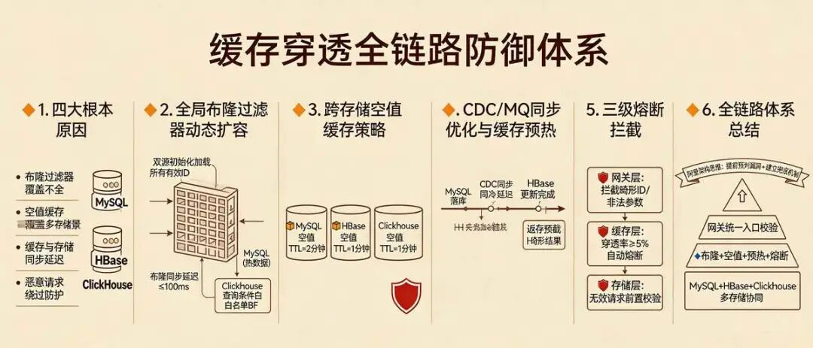
**一、核心原因（4点，覆盖高频场景，贴合面试实战）：****(1) 布隆过滤器覆盖不全（最常见）：**初始化时仅加载了MySQL中的有效order_id，未同步加载HBase中的历史订单ID（温冷数据），导致查询HBase中的有效订单时，因布隆过滤器未命中，直接穿透至HBase；或新增订单未及时同步至布隆过滤器，短时间内查询新增订单ID，触发穿透。 **(2) 空值缓存失效或未覆盖全场景：**仅对MySQL中不存在的订单ID做空值缓存，未对HBase、ClickHouse中不存在的查询条件（如无效时间范围、非法商家ID）做空值缓存，导致分析类查询、历史订单查询的无效请求，直接穿透至HBase、ClickHouse。 **(3) 缓存与存储数据同步延迟：**订单数据从MySQL同步至HBase、ES的过程中（通过CDC工具、MQ）出现延迟，用户查询刚创建的订单时，缓存未命中、ES未同步、HBase未更新，只能穿透至MySQL主库，若此时MySQL主库压力大，会放大穿透影响。 **(4) 恶意请求绕过防护：**黑客或测试场景下，构造大量畸形order_id（如超长字符串、特殊字符），布隆过滤器无法识别（布隆过滤器仅对有效格式ID生效），空值缓存也未针对畸形ID做处理，导致此类请求直接穿透至MySQL、HBase，消耗存储资源。 **二、解决方案（对应原因，结合缓存三件套+多存储协同，可落地、可量化）：****(1) 完善布隆过滤器，覆盖全存储有效ID：**- 初始化时，同步加载MySQL（热数据）、HBase（温冷数据）中的所有有效order_id，构建全局布隆过滤器，支持动态扩容（新增订单时，实时将order_id同步至布隆过滤器，延迟≤100ms）；
- 针对ClickHouse分析场景，额外构建“查询条件白名单布隆过滤器”（如有效时间范围、合法商家ID），拦截无效分析查询条件，避免穿透至ClickHouse。

**(2) 优化空值缓存，覆盖多存储、多场景：**- 扩大空值缓存范围：不仅对MySQL中不存在的order_id做空值缓存（TTL=2分钟），对HBase、ClickHouse中不存在的查询条件，也写入空对象缓存（TTL=1分钟，缩短过期时间，避免缓存冗余）；
- 对畸形order_id、非法查询参数，直接在网关层拦截，不进入缓存+存储链路，从源头杜绝恶意穿透请求。

**(3) 降低缓存与存储同步延迟，减少穿透概率：**- 优化CDC同步配置（Canal/Debezium），将MySQL→HBase的数据同步延迟控制在1s内；优化MQ消息投递优先级，将订单创建、状态变更消息设为最高优先级，确保缓存刷新、ES同步、HBase更新的时效性；
- 新增“缓存预热兜底机制”，订单落库后，同步触发缓存预热（即使缓存未命中，也优先从HBase读取，避免直接穿透至MySQL主库），尤其针对新增订单，实现“落库→同步→预热”一站式流程。

**(4) 新增多级拦截，强化兜底防护（面试加分，体现全链路思维）：**- 网关层新增请求校验：拦截畸形order_id、非法查询参数，无需进入缓存和存储层，直接返回无效提示；
- 缓存层新增“穿透熔断机制”：当某类请求穿透率≥5%（可配置），自动熔断该类请求，暂时返回默认值，同时触发告警，运维人员快速排查原因（如布隆过滤器失效、同步延迟）；
- 存储层新增“无效请求拦截”：在MySQL、HBase、ClickHouse前端增加请求校验，对无效ID、非法条件直接返回空结果，不执行底层查询，降低IO消耗。

## 5.3 追问3：如何保证MQ架构三件套中的“0丢失”？如果出现消息丢失，怎么排查？
标准答案（分“落地保障+排查思路”，贴合面试实战，串联多套件）： **一、0丢失落地保障（MQ三件套核心落地细节，结合业务场景）：**需实现“生产端→MQ端→消费端”全链路可靠，三者缺一不可，同时联动其他套件保障： **(1) 生产端：**开启事务消息（如RocketMQ事务消息），确保“订单落库”与“消息发送”原子性，结合存储层四件套的异步双写，避免订单落库成功但消息未发送的情况； 发送失败后，触发本地重试（最多3次），重试失败则写入死信队列，人工兜底。 **(2) MQ端：**开启消息持久化（磁盘存储），集群部署避免单点故障； 关闭自动清理机制，确保消息未消费前不被删除； 开启主从同步，主节点宕机时从节点无缝接管，避免消息丢失。 **(3) 消费端：**开启手动ACK，确保消息消费完成（如缓存刷新、ES同步成功）后再确认； 结合缓存三件套、ES四件套，消费完成后校验数据一致性，未校验通过则不ACK，触发MQ重试； 消费失败时，写入死信队列，结合存储层四件套的多级补偿机制修复。 **二、消息丢失排查思路（从链路排查，体现系统性思维）：****(1) 排查生产端：**查看生产端日志，确认消息是否发送成功、事务是否提交； 排查是否因网络波动导致消息发送超时，未触发重试机制；检查MQ事务消息状态，是否存在“半事务消息”未提交的情况。 **(2) 排查MQ端：**查看MQ集群日志，确认消息是否持久化成功、主从同步是否正常； 排查是否因MQ节点宕机，未及时切换至从节点；检查消息是否因过期时间设置过短，未消费即被清理。 **(3) 排查消费端：**查看消费端日志，确认消息是否被消费、ACK是否正常； 排查是否因消费逻辑异常（如缓存刷新失败、ES同步报错），导致消费未完成但误ACK； 检查死信队列，是否有大量未消费的失败消息，结合多级补偿机制修复。 ## 5.4 追问4：存储层四件套中的“冷热分离”，落地时如何避免冷数据归档导致的查询异常？
标准答案（结合落地细节，体现风险防控，串联多套件）： 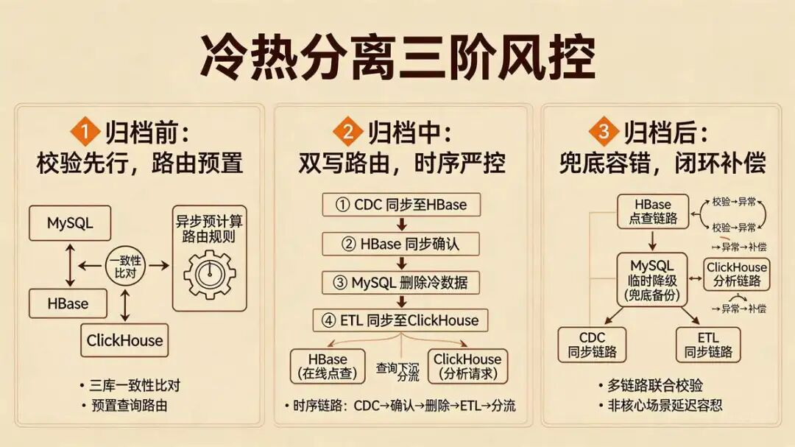
核心思路： 冷热分离的核心是“数据分层不影响查询体验”，需结合服务架构三件套、数据一致性两件套，做好“归档前校验、归档中路由、归档后补偿”，避免查询异常，具体落地如下（适配MySQL+HBase+ClickHouse存储架构）： > 尼恩提示：原文3w字以上，  此文是精简版，完整版本，请参考 尼恩 免费百度网盘 免费pdf

## 5.5 追问5：为啥不用HBase做分析查询？为啥不用ClickHouse做点查？
选择哪种存储引擎承接对应查询？ 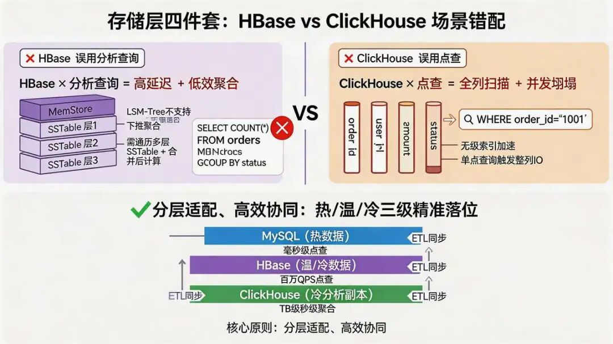
核心是“适配场景、发挥引擎优势”，避免“用错场景导致性能瓶颈、查询异常”。 结合MySQL+HBase+ClickHouse架构的定位，具体原因如下 > 尼恩提示：原文3w字以上，  此文是精简版，完整版本，请参考 尼恩 免费百度网盘 免费pdf

## 5.6 追问6：HBase 和 ClickHouse 底层都用了 LSM-Tree ，为啥差距这么大？
核心思路： 两者虽均基于LSM-Tree，但差距的核心的是“LSM-Tree的适配改造不同+引擎设计定位、存储结构、优化方向完全不同”，并非单纯依赖底层存储结构，具体原因如下（结合前文引擎特性，便于面试串联作答）： 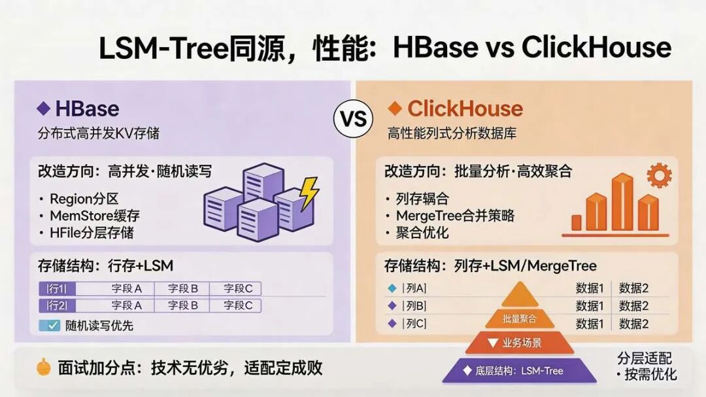
> 尼恩提示：原文3w字以上，  此文是精简版，完整版本，请参考 尼恩 免费百度网盘 免费pdf

## 5.7 追问7：你去怎么区别查询mysql，什么情况查询ES，什么情况查询hbase ？
核心区别： **按查询场景、数据热度、性能需求精准匹配**三者属于异构存储协同体系（存储层四件套 + 搜索层四件套），无替代关系，仅分工不同，结合 1000 万订单场景，具体区别及适用情况如下： #### （1）、查询 MySQL：热数据 + 核心精准查询（优先选）
**适用 3 类核心场景****(1) 热数据高频精准查询：**近 30 天的订单（热数据），以【主键 / 索引精准查询】为主，比如用户查自己的订单详情、支付后立即查订单状态（L1 级核心场景）。 **(2) 强一致性需求查询：**订单创建、支付状态变更等场景，需保证数据实时一致，必须直连 MySQL 主库，避免数据延迟导致用户感知异常。 **(3) 简单高频读写查询：**无需复杂聚合、仅需单表 / 少量关联的查询，比如根据 order_id 查订单金额、根据用户 ID 查近 7 天订单列表（未下沉至 HBase 的热数据）。 **核心原因**MySQL 主打【强一致性、低延迟、精准读写】，适配热数据的高频访问，是订单系统的核心交易存储，能保障核心场景的实时性和数据准确性，对应存储层四件套中【热数据存储】的核心定位。 #### （2）查询 ES：聚合搜索 + 复杂条件检索（替代 MySQL 复杂查询）
适用 2 类核心场景 **(1) 多维度聚合检索：**运营多维度筛选、模糊查询、聚合统计，比如 “查北京地区近 30 天已支付的订单数”“按商品类别统计订单金额”，需多字段组合查询。 **(2) 实时检索需求：**对查询延迟要求较高（毫秒级），无需强一致性，但需快速返回聚合结果，比如商家实时查自身店铺的订单分布、平台实时监控订单趋势。 **核心原因**ES 主打【实时检索、复杂聚合】，能高效处理多字段组合、模糊匹配等 MySQL 不擅长的场景，对应搜索层四件套的核心定位，可彻底卸载 MySQL 的聚合查询压力，与 MySQL 协同实现 “精准查找 MySQL、聚合查找 ES”。 #### （3）查询 HBase：温冷数据 + 高并发点查（替代 MySQL 历史数据查询）
适用 3 类核心场景： **(1) 温冷数据点查：**30~180 天（温数据）、超过 180 天（冷数据）的订单，以【主键精准查询】为主，比如用户查半年前的订单详情、客服查历史订单记录。 **(2) 高并发 点查场景：**热点商家、高频历史订单查询，需承受高并发请求，比如 TOP100 商家实时查自身历史订单，HBase 的高吞吐特性可分流 MySQL 压力。 **(3) 海量数据存储查询：**无需复杂聚合，仅需单条 / 少量数据查询，且数据量巨大（千万级以上冷数据），MySQL 存储成本高、查询效率低，HBase 可实现低成本、高可用存储。 **核心原因**HBase 主打【高并发、高扩展、海量数据点查】，适配温冷数据的存储和查询，对应存储层四件套中【温冷数据主库】的定位，与 MySQL 协同实现冷热分离，既降低 MySQL 存储压力，又保障历史订单查询的可用性。 #### （4）查询 ClickHouse：批量分析 + 大数据量扫描（替代 MySQL/HBase 分析查询）
适用 3 类核心场景： **(1) 批量分析查询：**无需实时响应（秒级可接受），需处理大批量数据聚合、多表关联的场景，比如财务月结对账、月度/季度订单统计、平台年度经营分析，需扫描千万级以上全量订单数据。 **(2) 复杂统计报表：**运营离线报表、多维度深度分析，比如 “各区域、各品类订单销量排行”“用户消费行为画像分析”，需对海量订单数据进行多字段聚合、分组、关联计算。 **(3) 冷数据分析查询：**超过 180 天的冷数据统计分析，比如历史订单复盘、年度财务审计，数据已归档至 HBase，通过 ETL 同步至 ClickHouse，专门承接此类低实时性、高吞吐的分析需求。 **核心原因**ClickHouse 主打【高性能列式分析、高吞吐批量查询】，适配海量数据的扫描和聚合，对应存储层四件套中【冷数据分析副本】的定位，可彻底卸载 MySQL、HBase 的分析查询压力，与 ES 形成互补（ES 侧重实时检索、ClickHouse 侧重批量分析），保障分析场景的高效性。 **总结（面试可直接套用）**- 查【热数据、核心精准、强一致性】→ 选 MySQL（近 30 天订单、支付后查单、主键精准查）；
- 查【复杂聚合、模糊匹配、实时检索】→ 选 ES（运营筛选、多维度统计、模糊查单）；
- 查【温冷数据、高并发点查、海量历史数据】→ 选 HBase（历史订单详情、高频历史点查）。
- 查【批量分析、大数据量扫描、离线报表】→ 选 ClickHouse（财务对账、年度统计、冷数据分析）。

三者通过MQ、 CDC、ETL 实现数据同步，结合数据一致性两件套保障查询准确，构成 “MySQL+ES+HBase” 的异构存储协同体系，完美适配 1000 万订单的全场景查询需求。 # 六、总结： 尼恩架构七件套+  异构存储 ，才是大厂面试的核心竞争力
回到开篇的阿里面试题——“每天1000万订单查询，怎么优化？” 真正的标准答案，从来不是“加缓存、分库分表”这种单点技巧，而是你能搭建一套完整的架构七件套+  异构存储  体系： - 用流量架构三件套守住入口
- 用服务架构三件套释放潜力
- 用缓存架构三件套筑牢防线
- 用MQ架构三件套保障异步可靠
- 用搜索层四件套提升检索效率
- 用存储层四件套（适配MySQL+HBase+ClickHouse架构）破解存储瓶颈。 MySQL存热数据、HBase存温+冷数据并承接在线点查、ClickHouse存冷数据分析副本承接统计分析
- 用数据一致性两件套平衡性能与可靠。

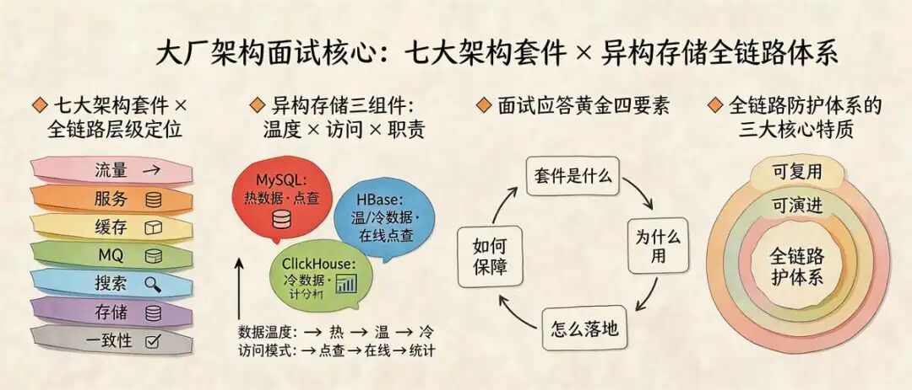
**尼恩的这套体系，**不仅能解决1000万订单查询的问题，更能适配业务增长后的各种高并发场景，这正是阿里等大厂所看重的“系统性架构思维”。 不是解决一个点，而是构建一个可复用、可演进、可落地的全链路防护体系。 记住： 面试时，讲清“套件是什么、为什么用、怎么落地、如何保障”，比单纯讲技术细节更有说服力。 这套结合MySQL+HBase+ClickHouse存储架构改造后的方案，既贴合面试高频考点，又具备落地性，直接套用就能应对大厂终面的各类追问。 ## 说在最后：有问题找45岁老架构取经‍
尼恩提示：   要拿到 高薪offer， 或者 要进大厂，必须来点 **高大上、体系化、深度化**的答案， 整点技术狠活儿。 只要按照上面的 尼恩团队梳理的 方案去作答， 你的答案不是 100分，而是 120分。  面试官一定是 心满意足， 五体投地。 按照尼恩的梳理，进行 深度回答，可以充分展示一下大家雄厚的 “技术肌肉”， **让面试官爱到 “不能自已、口水直流”**，然后实现”offer直提”。 在面试之前，建议大家系统化的刷一波 5000页《 [尼恩Java面试宝典PDF](https://mp.weixin.qq.com/s?__biz=MzkxNzIyMTM1NQ==&mid=2247497474&idx=1&sn=54a7b194a72162e9f13695443eabe186&scene=21#wechat_redirect)》，里边有大量的大厂真题、面试难题、架构难题。 很多小伙伴刷完后， 吊打面试官， 大厂横着走。 在刷题过程中，如果有啥问题，大家可以来 找 40岁老架构师尼恩交流。 另外，如果没有面试机会， 可以找尼恩来改简历、做帮扶。前段时间， **空窗2年 成为 架构师， 32岁小伙逆天改命， 同学都惊呆了。**狠狠卷，实现 “offer自由” 很容易的， 前段时间一个武汉的跟着尼恩卷了2年的小伙伴， 在极度严寒/痛苦被裁的环境下， offer拿到手软， 实现真正的 “offer自由” 。 ## 持续 学习 尼恩 “ Java 架构 +AI 架构 ”，不怕裁员，不用焦虑、 没有中年危机
[会 AI的程序员，工资暴涨50%！](https://mp.weixin.qq.com/s?__biz=MzIxMzYwODY3OQ==&mid=2247486827&idx=1&sn=db3f268c6752ddb074a98c7b13a84011&scene=21#wechat_redirect)
[一飞冲天， 逆 首席：37 岁  借力 Java+AI 逆袭  首席架构， 年薪80W+太香了](https://mp.weixin.qq.com/s?__biz=MzIxMzYwODY3OQ==&mid=2247487126&idx=1&sn=9016db06543f328a42cd37eadfceffee&scene=21#wechat_redirect)
[31岁 /专科升架构成功， 收10个offer 变offer 皇帝！！  下一步，直冲100W](https://mp.weixin.qq.com/s?__biz=MzIxMzYwODY3OQ==&mid=2247487047&idx=1&sn=0397145548d8c1e76ee900c7e5920f4d&scene=21#wechat_redirect)
[奇迹 :一年 涨2倍，   年薪 60W 梦想实现  。 接下来，开启 40岁之前的 年薪  200W 梦想](https://mp.weixin.qq.com/s?__biz=MzIxMzYwODY3OQ==&mid=2247487014&idx=1&sn=5d1359a7adc7c9e46e6374597bb03138&scene=21#wechat_redirect)
[28岁/6年/被裁1年，收 3 大厂offer ， 成大厂 皇后。2本学历 51W 年薪，惊天 逆涨，涨薪2倍](https://mp.weixin.qq.com/s?__biz=MzIxMzYwODY3OQ==&mid=2247486987&idx=1&sn=ff977f450dd242446f228d3a6585e258&scene=21#wechat_redirect)，大厂皇后 
[涨薪传奇： 18k->38K ,单月暴20K，32岁小伙伴 2个月时间年薪 翻1.5倍 ，一步登天+逆天改命](https://mp.weixin.qq.com/s?__biz=MzIxMzYwODY3OQ==&mid=2247486960&idx=1&sn=f57253a448694c32e834207381c42284&scene=21#wechat_redirect)
[低学历 传奇：29岁6年专套本，受够了外包，狠卷3个月逆袭大厂 涨 1倍， 逆天改命](https://mp.weixin.qq.com/s?__biz=MzIxMzYwODY3OQ==&mid=2247486945&idx=1&sn=f6ff6231ccf3585624161c2ef1f50fdf&scene=21#wechat_redirect)
[极速上岸： 被裁 后，8天 拿下 京东，狠涨 一倍 年薪48W， 小伙伴 就是 做对了一件事](https://mp.weixin.qq.com/s?__biz=MzIxMzYwODY3OQ==&mid=2247486913&idx=1&sn=edd6774e9d17c39327e8dcb95fdd68d9&scene=21#wechat_redirect)
[外包+二本 进 美团： 26岁小2本 一步登天， 进了顶奢大厂（ 美团） ， 太爽了](https://mp.weixin.qq.com/s?__biz=MzIxMzYwODY3OQ==&mid=2247486904&idx=1&sn=e7c878f99ed101ebfbd1d80ec0e07401&scene=21#wechat_redirect)
[超牛的Java+Al 双栖架构： 34岁无路可走，一个月翻盘，拿 3个架构offer，靠  Java+Al   逆天改命！！！](https://mp.weixin.qq.com/s?__biz=MzIxMzYwODY3OQ==&mid=2247486848&idx=1&sn=ff43d058271b0801f84aba3f3d957855&scene=21#wechat_redirect)java+AI 逆袭2 ： [：3年 程序媛 被裁， 25W-》40W 上岸， 逆涨60%。 Java+AI 太神了， 架构小白 2个月逆天改命](https://mp.weixin.qq.com/s?__biz=MzIxMzYwODY3OQ==&mid=2247486858&idx=1&sn=9cd122c18d166433b43d0952d3a7a7a8&scene=21#wechat_redirect)[Java+AI逆袭3 ： 36岁/失业7个月/彻底绝望 。狠卷 3个月 Java+AI ，终于逆风翻盘，顺利 上岸](https://mp.weixin.qq.com/s?__biz=MzIxMzYwODY3OQ==&mid=2247486870&idx=1&sn=990a540a155cdb8254ebce6c75816882&scene=21#wechat_redirect)[Java+AI逆袭 ： 闲了一年，41岁/失业12个月/彻底绝望 。狠卷 2个月 Java+AI ，终于逆风翻盘](https://mp.weixin.qq.com/s?__biz=MzIxMzYwODY3OQ==&mid=2247486880&idx=1&sn=a37033157c766ac5ae7c9195fe776693&scene=21#wechat_redirect)

[Java+AI逆袭5：1个月大涨2.5W，37岁 脱坑外包， 入了正编，GO+AI 要逆天了](https://mp.weixin.qq.com/s?__biz=MzIxMzYwODY3OQ==&mid=2247486885&idx=1&sn=4e26fbb093f45d437dedf14ea9b9e6c5&scene=21#wechat_redirect)

**职业救助站**实现职业转型，极速上岸

关注 **职业救助站**公众号，获取每天职业干货 
助您实现 **职业转型、职业升级、极速上岸**
---------------------------------

**技术自由圈**实现架构转型，再无中年危机

关注 **技术自由圈**公众号，获取每天技术千货 
一起成为牛逼的 **未来超级架构师**

**几十篇架构笔记、5000页面试宝典、20个技术圣经请加尼恩个人微信免费拿走**

**暗号，请在 公众号后台 发送消息：领电子书**

如有收获，请点击底部的" 在看 "和" 赞 "，谢谢
